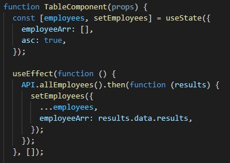
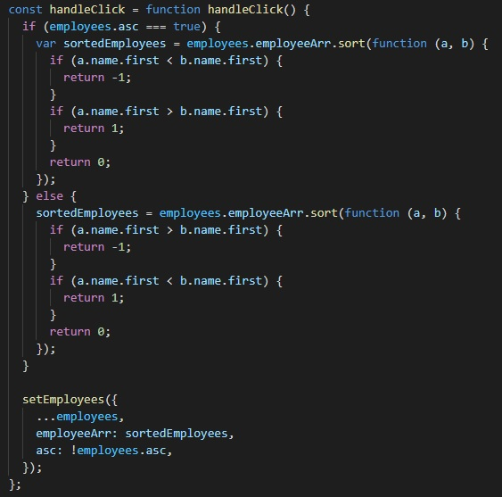
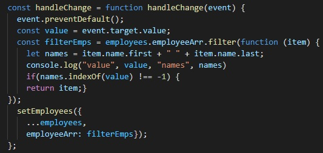
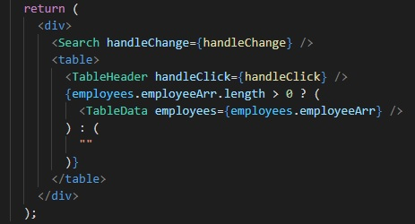
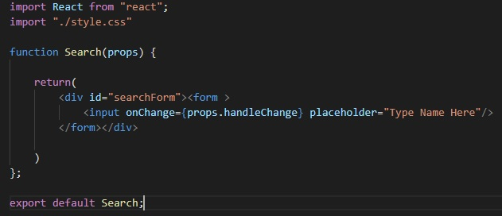
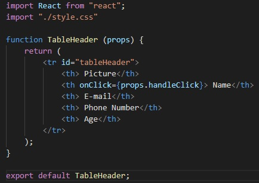
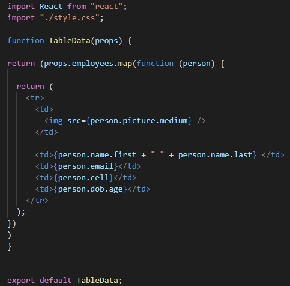

Employee Directory
====

# Description
The Employee Directory is a React application that utilizes hooks to populate a list of employees via an API call and allows for sorting and filtering of the list with the hooks as well.

----

# What's inside??
States were changed using `hooks` rather than classes. The hooks were set up in the `Table` folder within the `Component` folder.

This is our initial state, just an empty array and some boolean value. The `useEffect` Hook is used on an API call.
The API used was [Random User Generator](https://randomuser.me/).
The axios query returns to us JSON data for random, made-up employees and we include them in the state, giving the key of `employeeArr` whose value is an empty array a value of the results of the API call, a fully populated array.

Next, let's create a state that can sort the employees:

This conditional statement checks for the value of the boolean that was initially part of our state and then sorts employees based on alpha order. In simple terms, the conditions will "flip" the positions of the employees in the array if the conditions are met, using our `return 0` as an axis. After the ascending order is accounted for, the condition is flipped so names can be seen in descending order. On the last lines where `asc: !employees.asc` is seen, what this does is essentially change the boolean value each time our target is clicked so that we can toggle between conditions.

Let's now filter the employee list:

This function takes the value of the target, in this case the search form on the page, and references its value to names in the employee array. As the input is placed into the form it will populate the `employeeArr` with all the relevant values and display them on the page.

Finally, we will pass on these props to the children they ought to be assigned to:

Here, it is clear the `hangleChange` function is being passed on to the `Search` component, the `handleClick` to the `TableHeader` and the `employeeArr` goes to the `TableData` component.
Let's take a look at how these components handle their props.

Once the work of defining the states and using all the hooks has been done it's as simple as passing the props down to the children. For the employees there is one extra step of mapping out the array, which you can see nests the elements we are returning into the map function so that for each index a component is created.

----

# Project Link
[Deployed Link](https://spenrad.github.io/Employee-Directory/)  
[Project Repository](https://github.com/spenrad/Employee-Directory)  

----

# Spencer Christy
[GitHub](https://github.com/spenrad) 
[LinkedIn](https://www.linkedin.com/in/spencer-christy-543b84b3/) 

